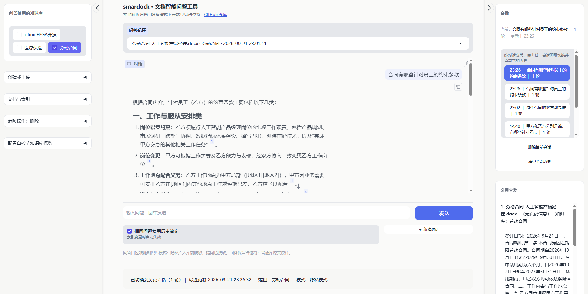

# smardock · 文档智能问答工具


面向个人的本地文档知识库：把 PDF / Word 归档入库，用自然语言提问，答案带**可追溯的原文引用**；隐私文档全程脱敏，真实信息不出本地。

采用 Gradio + ChromaDB + SQLite，向量化与问答生成借助云端大模型API完成，敏感信息识别在本地完成。




---

## ✨ 功能亮点

### 📚 拖入文档，直接开问
- 支持 PDF、Word 等常见格式，自动解析入库
- 可以建多个知识库，按主题分类，选择一个或多个知识库进行提问
- 可以只针对某一篇文档单独提问

### 🎯 回答准确、有据可查
- 既懂「意思相近」的提问，也能精确命中型号、编号这类关键词
- 每句回答都标注原文出处，点击即可查看引用片段、下载原件

### 🔐 隐私文档放心用
- 建库时可选「隐私模式」，上传的文档会先打码再处理
- 姓名、身份证号、电话、地址等敏感信息全程用占位符代替，真实信息不出本地
- 连文件名和路径都会打码，杜绝隐私泄漏

### 💬 对话自动保存、按主题整理
- 支持新建、切换、删除多个对话，历史一目了然
- 相同问题直接复用答案，节省词元(token)

---

## 🚀 使用方法

### 获取代码

启动之前，请先获取代码。

```bash
git clone https://github.com/bggcs111/smardock.git
cd smardock
```

### 前置要求
- Python 3.10+
- 一个**向量化模型** API Key（默认阿里云百炼 DashScope `text-embedding-v3`）
- 一个**问答模型** API Key（如deepseek-flash）
### 模型与运行环境

本项目「本地模型」与「云端 API」分工明确：**敏感信息识别在本地跑，检索与生成走云端**。


#### 本地 NER 模型说明

NER模型为damo/nlp_raner_named-entity-recognition_chinese-base-generic，全本地运行，可增强脱敏信息的准确性。CPU即可推理，无需GPU。
默认不会安装此模型，如果需要使用NER模型，可手动取消requirements.txt中的相关注释进行安装。
未安装NER模型时，会自动降级为「正则 + 标签锚定」脱敏策略。


### 一键启动

**Windows**

运行项目根目录下的start.bat。

```bat
start.bat
```

**macOS / Linux**

运行项目根目录下的start.sh。

```bash
bash start.sh
```

脚本会自动创建虚拟环境、安装依赖、从 `.env.example` 生成 `.env`。

### 手动启动

```bash
python -m venv .venv
source .venv/bin/activate        # Windows: .venv\Scripts\activate
pip install -r requirements.txt

cp .env.example .env             # 填入你的 API Key
python app.py
```

启动后访问 **http://127.0.0.1:7860**

### 三步上手
1. **建库**：左侧「知识库」新建一个库，选择模式（普通 / 隐私）
2. **上传**：选中该库，拖入 PDF 或 DOCX，等待解析与索引完成
3. **提问**：在对话框中提问，答案里的上标 `¹` 就是原文出处，点击可查看引用片段与下载原件

### 配置说明
所有参数集中在 `config.py`，通过项目根目录的 `.env` 覆盖。常用项：

| 变量 | 说明 | 默认 |
|---|---|---|
| `DASHSCOPE_API_KEY` | 向量化 API Key | — |
| `DEEPSEEK_API_KEY` | 问答模型 API Key | — |
| `EMBEDDING_PROVIDER` | `dashscope` / `openai`（兼容任意 OpenAI 协议端点） | `dashscope` |
| `PRIVACY_STRICT_REDACTION` | 隐私模式回答是否保留占位符 | `true` |
| `PRIVACY_MASK_SOURCE` | 隐私模式是否给来源文件名打码 | `true` |
| `SECTION_EXPAND` | 命中后是否展开整节 | `true` |
| `RERANK_ENABLED` | 是否启用重排序 | `true` |
| `PII_EXTRA_FIELDS` | 额外脱敏字段（逗号分隔，如 `性别,职业类别`） | 空 |
| `SERVER_PORT` | 服务端口 | `7860` |

---

## 🗺️ 计划事项

- [ ] **历史文档快捷搜索**：增加对过去上传文档的快捷搜索，快速定位已归档内容
- [ ] **引用片段快速预览**：点击引用即可快速预览对应文档片段
- [ ] **脱敏信息手动确认**：支持手动添加和确认脱敏信息，避免误伤
- [ ] **图片 / 表格 / 公式理解增强**：提高对图片、表格、公式的识别与理解准确度，并在回答时自动使用
- [ ] **精简和美化 UI 界面**：优化布局、配色与交互细节，提升使用体验

---

## 🙏 致谢

本项目站在以下优秀开源项目的肩膀上：

| 项目 | 用途 |
|---|---|
| [Gradio](https://github.com/gradio-app/gradio) | Web 交互界面 |
| [ChromaDB](https://github.com/chroma-core/chroma) | 向量存储与检索 |
| [PyMuPDF](https://github.com/pymupdf/PyMuPDF) | PDF 解析（版式几何） |
| [pymupdf4llm](https://github.com/pymupdf/RAG) | PDF → Markdown 版式模型 |
| [python-docx](https://github.com/python-openxml/python-docx) | Word 文档解析 |
| [python-dotenv](https://github.com/theskumar/python-dotenv) | 环境变量加载 |
| [OpenAI Python SDK](https://github.com/openai/openai-python) | 问答模型调用（DeepSeek 兼容协议） |
| [ModelScope](https://github.com/modelscope/modelscope) | 本地 NER 模型（RaNER） |
| [SQLite FTS5](https://www.sqlite.org/fts5.html) | BM25 关键词索引 |


---

## 📬 联系方式

- 作者：lowkyner
- 邮箱：bggcs111@163.com
- 问题反馈：[提交 Issue](https://github.com/bggcs111/smardock/issues)

> 使用中遇到问题，欢迎补充环境信息（操作系统 / Python 版本 / 复现步骤）后提交。
> 非常欢迎您提出改进建议或直接参与项目优化，包括但不限于：
> - 界面优化
> - 功能增强
> - 代码重构
> - 文档补充

---

## 📄 开源许可

本项目采用 [MIT License](LICENSE) 开源——可自由用于商业与非商业场景，只需保留版权声明。
